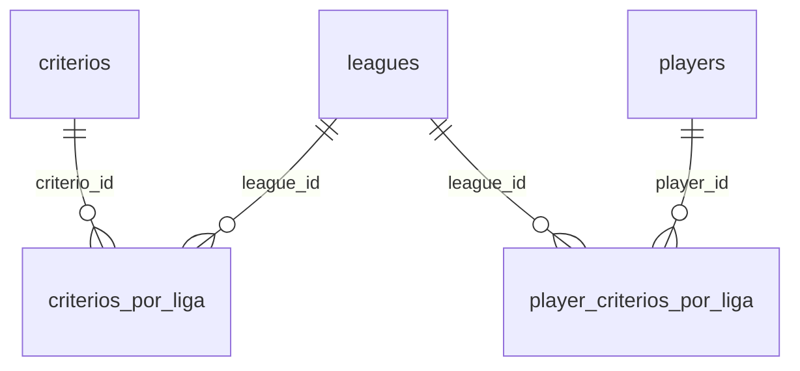

# 📘 README – Modelos de Critérios (`criterios.model.ts`)

## 🎯 Visão geral

O sistema de classificação permite configurar **critérios personalizados por liga**, com controle de peso, ativação e visibilidade.  
Além disso, permite que administradores preencham **valores individuais por jogador** para cada critério.

---

## 🧩 Modelos usados

### 1. `CriterioBase`

```ts
export interface CriterioBase {
  id: number;
  nome: string;
}
```

- Refere-se à tabela global `criterios`
- Criado uma única vez
- Pode ser reutilizado por múltiplas ligas
- Usado no componente `criterio-config` para listar critérios disponíveis

---

### 2. `CriterioDaLiga`

```ts
export interface CriterioDaLiga {
  id: number;                // corresponde a criterio_id
  nome: string;              // join com criterios.nome
  peso: number;              // define ordem de desempate
  ativo: boolean;            // define se será usado no cálculo
  league_id: string;
  mostrar_na_tabela: boolean; // define se será visível no ranking
}
```

- Reflete a tabela `criterios_por_liga`
- Controla critérios específicos de cada liga
- Usado no componente `ranking` e `criterio-config`
- Suporta `upsert` com constraint `criterio_id + league_id`

---

### 3. `PlayerCriterioValor`

```ts
export interface PlayerCriterioValor {
  player_id: string;
  league_id: string;
  criterio: string; // nome do critério
  valor: number;
}
```

- Reflete a tabela `player_criterios_por_liga`
- Armazena os valores preenchidos por jogador
- Utilizado no `ranking.component` para leitura e edição
- O campo `criterio` é o **nome**, não o `id` (para permitir acesso direto via `.criterios[crit.nome]`)

---

## 🛠️ Services relacionados

| Serviço                 | Função                                   |
|-------------------------|-------------------------------------------|
| `CriterioService`       | CRUD dos critérios por liga              |
| `PlayerCriterioService` | CRUD dos valores dos jogadores           |

---

## 🔗 Relacionamentos no Supabase



---

## ✅ Regras e boas práticas

- Sempre use `onConflict: 'criterio_id,league_id'` ao fazer `upsert` em `criterios_por_liga`
- Evite duplicar critérios no Supabase — use `criterios` como fonte única
- Critérios **inativos** não devem afetar a ordenação do ranking
- Use `mostrar_na_tabela: false` para critérios auxiliares que não precisam aparecer no frontend